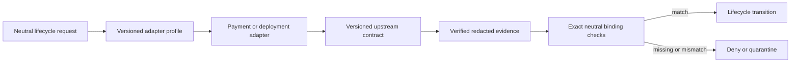
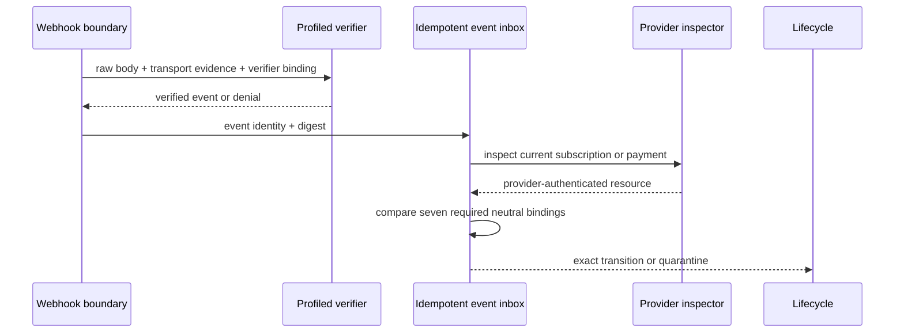

# SaaS adapter mapping profiles

## Purpose

The lifecycle contract says what must be proved before billing or deployment
state changes. An adapter profile says where a specific adapter obtains that
evidence. It is declarative mapping data, not an HTTP client, workflow script,
credential file or replacement for an upstream API contract.

The normative schema is
`standard/saas-adapter-profile.schema.json`. Validated PayPal, Stripe and
Plesk/Wellmanifest mappings are in
`standard/adapter-profiles.examples.json`. Profiles are versioned separately
from offers and lifecycle state, so an API mapping can be replaced without
renaming a plan or rewriting historical receipts.

## Profile composition

Every profile binds a stable `profileRef`, `adapterRef`, semantic version and
one or more upstream contract references. Each operation declares:

- whether it is a query, command or verification;
- the upstream operation contract;
- neutral request fields mapped to provider input pointers;
- provider, registry, ledger or verifier evidence mapped back to neutral fields;
- an explicit idempotency source.

Pointers are locations in an adapter-owned input or verified result, not
instructions to retain whole provider payloads. A profile is rejected if a
pointer creates a channel for credentials, payment-card fields or deployment
coordinates such as a hostname, user, domain or docroot.

## Payment boundary

A payment profile must provide exactly these neutral operations:
`create_subscription`, `inspect_subscription`, `cancel_subscription`,
`create_payment`, `inspect_payment`, `capture_payment` and `verify_event`.
Commands and event verification require an idempotency key. Queries are
side-effect free.

Before a transition, the adapter must prove the exact `accountRef`, `tenantRef`,
`planRef`, `priceRef`, `amountMinor`, `currency` and provider status against the
request ledger, versioned offer and provider-plan registry. A browser approval
is only a prompt to inspect the provider resource; it is not evidence of paid
state.

All webhook mappings require both signature verification and authoritative
resource inspection. Unknown events are quarantined, out-of-order events cause
a current-resource lookup, and stale events make no transition. The raw payload
belongs only in a separately governed evidence store; lifecycle receipts retain
references and digests.

## Deployment boundary

A deployment profile has five phases: `compile`, `authorize`, `apply`, `verify`
and `rollback`. Billing may enqueue deployment, but it cannot skip any phase.
The durable outbox reuses one idempotency key and is claimed by one bounded
worker lease. Commands use that key; retries are finite.

`authorize` obtains a single-use external grant for the compiled plan hash. The
grant is passed to the executor but is never persisted in the lifecycle profile
or receipt. `apply` alone cannot activate a tenant: a separate verifier must
return the expected plan hash, resource reference and redacted evidence
reference. A mismatch ends as `failed`.

Account, tenant, plan, deployment, plan hash, grant and idempotency references
are allowed in the profile. Hosts, subscriptions, users, paths and docroots are
resolved only behind the referenced deployment binding. This keeps a Plesk
mapping compatible with a future Kubernetes, Nomad or other deployment adapter.

## Concrete mappings reviewed

The examples were checked against upstream documentation on 2026-08-13:

| Profile | Upstream operations | Neutrality consequence |
| --- | --- | --- |
| PayPal REST | [Orders v2](https://developer.paypal.com/docs/api/orders/v2/), [Subscriptions v1](https://developer.paypal.com/docs/api/subscriptions/v1/) and [webhook signature verification](https://developer.paypal.com/docs/api/webhooks/v1/) | Provider event names and JSON fields occur only in the PayPal profile. Verification succeeds only on the provider's positive verification result and is followed by inspection. |
| Stripe REST | [PaymentIntents](https://docs.stripe.com/api/payment_intents), [Subscriptions](https://docs.stripe.com/api/subscriptions) and [signed webhooks](https://docs.stripe.com/webhooks) | Different field, event and signature vocabularies fit the same neutral operation set; webhook events trigger inspection rather than direct activation. |
| Plesk/Wellmanifest | POA compilation, external deployment grants and profiled Plesk publish/verify/rollback capabilities; Plesk also documents its remote [XML API boundary](https://docs.plesk.com/en-US/obsidian/api-rpc/about-xml-api.28709/) | The profile passes only opaque deployment references and hashes. Plesk coordinates and authorization stay behind the deployment adapter. |

The examples are informative adapter bindings but schema-valid documents. They
do not certify a merchant account, a Plesk server or a particular adapter
implementation. Those systems need their own contract tests and digital twins.

## Neutral review result

The profile family passes the following neutrality checks:

1. The existing lifecycle schema and grammar remain unchanged.
2. Payment and deployment are separate discriminated profile variants.
3. Two payment providers with different API shapes validate against the same
   closed operation and evidence model.
4. Provider status and event names never become core lifecycle vocabulary.
5. All mutating operations are idempotent and all retries are bounded.
6. Event verification, resource inspection and exact offer comparison are
   separate required boundaries.
7. Deployment activation requires both apply and independent verification.
8. Credentials, raw provider payloads, personal/payment data, target
   coordinates and grants have no lifecycle storage channel.

Adding another provider therefore means publishing a new profile and adapter
conformance evidence. It does not require extending the neutral lifecycle state
machine merely because the provider uses different endpoints or names.
