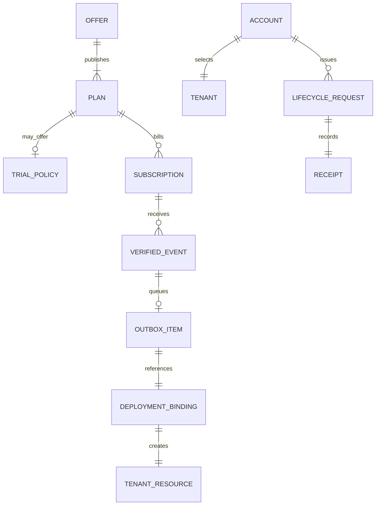

# SaaS Lifecycle architecture

## Scope and standard composition

The lifecycle standard describes commercial and provisioning state. It does
not authenticate users, process payments, deploy tenants or configure DNS.

- `wellmanifest/dsl` constrains lifecycle requests;
- POA compiles requests into exact plans, grants and receipts;
- `wellmanifest/deployment` executes an exact tenant deployment binding;
- `wellmanifest/product-lifecycle` owns product identity, stage and
  jurisdiction-aware catalog availability;
- `wellmanifest/legal-lifecycle` owns licenses, policies and location
  rules bound by the existing `legalPolicyRef`;
- `wellmanifest/agent` may later bind operational `agentRef` values;
- payment, identity and tax/legal systems remain external authorities. This
  module does not define license text, tax tables or refund law.

```mermaid
flowchart LR
    Offer[Versioned offer] --> Signup[Signup and membership verification]
    Signup --> Trial[Explicit trial policy]
    Signup --> Billing[Provider billing adapter]
    Trial --> Notice[Conversion notice boundary]
    Notice --> Billing
    Billing --> Verify[Server-side subscription verification]
    Verify --> Events[Signed idempotent event inbox]
    Events --> Outbox[Provisioning outbox]
    Outbox --> Deploy[Wellmanifest deployment plan]
    Deploy --> Tenant[Versioned tenant resource]
    Tenant --> Receipt[Secret-free lifecycle receipt]
```

## Normative invariants

1. Every public offer MUST be versioned and identify an authoritative
   settlement amount/currency. Localized currency values are indicative quotes
   with rational rate and `asOf`; they cannot change settlement.
2. A trial MUST declare duration, zero price, payment-method requirement,
   conversion plan, conversion mode, notice period and cancellation-before-
   charge guarantee. Missing conversion semantics fail closed.
3. `explicit-accept` cannot charge without a new accepted request. A
   `scheduled-after-notice` conversion requires a verified payment method and
   a notice boundary at least the declared number of days before trial end.
4. The browser/UI is not a billing authority. A client callback can trigger a
   server lookup but cannot set paid, active or subscription state.
5. Subscription identity, plan, amount, currency, tenant and provider status
   MUST be verified server-side against the selected versioned offer.
6. Webhook/event intake MUST verify the provider signature before persistence,
   deduplicate by provider event/idempotency key and process an event at most
   once. Raw provider payloads are retained only in a separately governed
   evidence store, never in lifecycle receipts.
7. Payment verification and tenant provisioning are separate transactions.
   Successful billing creates a durable outbox entry; it does not imply that a
   tenant is active.
8. Provisioning MUST bind account, tenant, plan, deployment definition and one
   stable idempotency key. Retries update the same outbox item.
9. Tenant hostnames, SSH users, docroots, ingress secrets, payment credentials,
   card data and provider tokens are forbidden in lifecycle documents. Use
   opaque binding/reference contracts.
10. Plan changes remain pending until billing and provisioning for the new plan
    are both verified. The old entitlement set remains authoritative until the
    atomic activation boundary.
11. Cancellation, suspension, expiration, failed provisioning and rollback are
    honest states and cannot be rewritten as active because an HTTP request
    succeeded.
12. Every accepted or denied request emits a redacted hash-bound receipt.

## Trust boundaries

| Boundary | Owns | Must reject |
| --- | --- | --- |
| Offer registry | Plans, trial, settlement and entitlements | Unversioned/implicit price or conversion |
| Identity service | Membership and authenticated account | Email-only ownership inference |
| Portal | Selection and user-visible state | Client-declared payment success |
| Payment adapter | Provider API and signature verification | Unsigned event, mismatched plan/tenant/amount |
| Event inbox | Idempotent event ledger | Duplicate processing or mutable event identity |
| Provisioning outbox | Durable exact tenant/plan work item | New tenant per retry, raw deployment coordinates |
| Deployment authority | Exact target plan and grant | Billing state as deployment authority |
| Receipt store | Redacted outcome/evidence hashes | Provider payload, credentials, personal/payment data |
| Product catalog | Product identity and stage | Prices, license text, deployment hosts |
| Legal pack | Versioned policy, license and location | Commercial settlement or tenant activation |

## Tenant hierarchy

The hierarchy is `account → tenant → plan → subscription/trial → provisioning
→ deployment resource`. Billing providers and deployment engines are adapters,
not owners of the lifecycle state machine.
