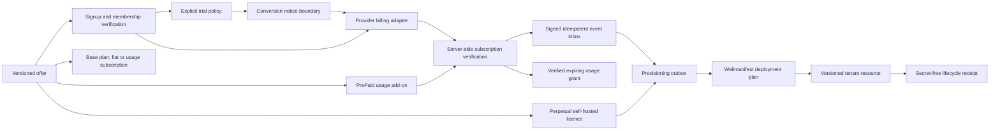
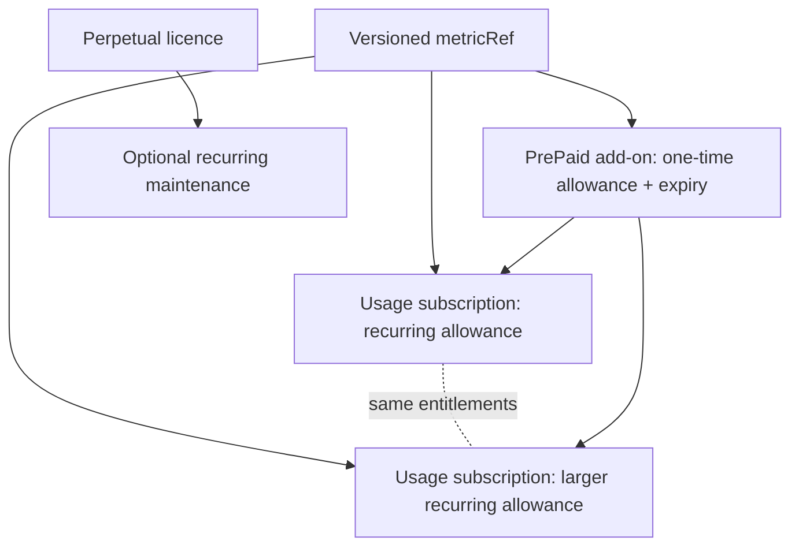
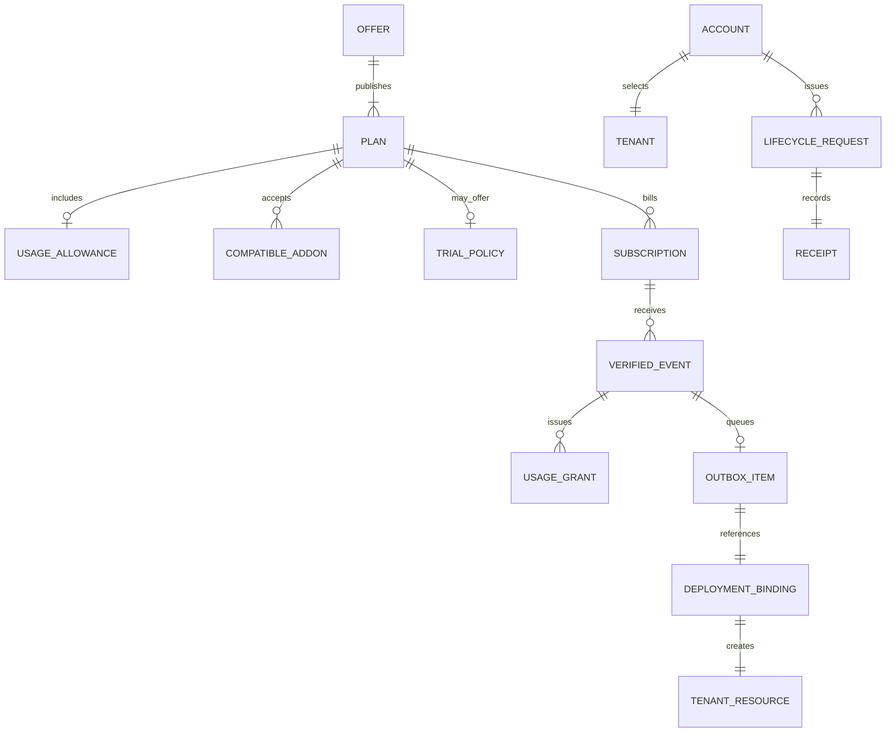

# SaaS Lifecycle architecture

## Scope and standard composition

The lifecycle standard describes commercial, usage-grant and provisioning
state. It does not authenticate users, define or meter a product-specific
usage unit, process payments, deploy tenants or configure DNS.

- `wellmanifest/dsl` constrains lifecycle requests;
- POA compiles requests into exact plans, grants and receipts;
- `wellmanifest/deployment` executes an exact tenant deployment binding;
- `wellmanifest/product-lifecycle` owns product identity, stage and
  jurisdiction-aware catalog availability;
- a metering authority owns the meaning, observation and deduction rules behind
  each opaque, versioned `metricRef`;
- `wellmanifest/legal-lifecycle` owns licenses, policies and location
  rules bound by the existing `legalPolicyRef`;
- `wellmanifest/agent` may later bind operational `agentRef` values;
- payment, identity and tax/legal systems remain external authorities. This
  module does not define license text, tax tables or refund law.

## Normative invariants

1. Every public offer MUST be versioned and every plan MUST identify one or
   more authoritative settlement options, commercial type and deployment mode.
   Every option has a unique versioned `priceRef`, and a plan has at most one
   option per interval. A human-readable name is neither plan nor price identity.
2. `flat-subscription`, `usage-subscription`, `prepaid-addon` and
   `perpetual-license` are distinct commercial shapes. No implementation may
   infer one from price interval, display copy, seat count or deployment mode.
3. A recurring usage allowance MUST reference a versioned external metric,
   positive included units, reset boundary and exhaustion policy. `metricRef`
   names semantics; this standard does not decide what one action, request,
   document, device or seat means or who observed it.
4. Plans in one `capabilityParityGroup` MUST have identical entitlement sets,
   deployment mode and commercial type. They may differ by settlement and
   included usage, making “same product, larger package” machine-checkable.
5. A PrePaid add-on MUST use one-time settlement, a never-reset positive
   allowance, explicit validity, compatible base-plan references and the same
   metric as those base plans. Purchasing it MUST NOT replace `currentPlanRef`.
6. A successful add-on purchase issues a unique server-verified usage grant
   bound to source `planRef`, selected `priceRef`, metric, billing reference,
   units and validity window. Browser state cannot issue, extend or replenish
   that grant.
7. A perpetual licence MUST settle once and use self-hosted or hybrid delivery.
   Optional maintenance is a separate recurring settlement with declared
   included periods and optional or notice-bound automatic renewal.
8. Every localized display quote MUST bind an explicit base/quote currency
   pair, positive rational rate and `asOf` date. Every locale default MUST have
   direct coverage from every settlement currency used by the offer unless the
   currencies are already equal. Quotes remain indicative and never alter
   settlement.
9. A presentation adapter MUST default by locale only when there is no valid
   explicit customer choice. It MUST disclose the indicative rate date and the
   authoritative settlement currency; a remembered explicit choice overrides
   the locale default.
10. A trial MUST declare duration, zero price, payment-method requirement,
   conversion plan, conversion mode, notice period and cancellation-before-
   charge guarantee. Missing conversion semantics fail closed.
11. `explicit-accept` cannot charge without a new accepted request. A
   `scheduled-after-notice` conversion requires a verified payment method and
   a notice boundary at least the declared number of days before trial end.
12. The browser/UI is not a billing authority. A client callback can trigger a
   server lookup but cannot set paid, active or subscription state.
13. Subscription identity, `planRef`, selected `priceRef`, amount, currency,
   interval, tenant and provider status MUST be verified server-side against
   the selected versioned offer. Monthly and annual prices may belong to one
   stable plan, but the lifecycle request and receipt bind the exact option.
14. Webhook/event intake MUST verify the provider signature before persistence,
   deduplicate by provider event/idempotency key and process an event at most
   once. Raw provider payloads are retained only in a separately governed
   evidence store, never in lifecycle receipts.
15. Payment verification and tenant provisioning are separate transactions.
   Successful billing creates a durable outbox entry; it does not imply that a
   tenant is active.
16. Provisioning MUST bind account, tenant, plan, deployment definition and one
   stable idempotency key. Retries update the same outbox item.
17. Tenant hostnames, SSH users, docroots, ingress secrets, payment credentials,
   card data and provider tokens are forbidden in lifecycle documents. Use
   opaque binding/reference contracts.
18. Plan changes remain pending until billing and provisioning for the new plan
    are both verified. The old entitlement set remains authoritative until the
    atomic activation boundary.
19. Cancellation, suspension, expiration, usage exhaustion, add-on expiry,
    failed provisioning and rollback are honest states and cannot be rewritten
    as active or available because an HTTP request succeeded.
20. Every accepted or denied request emits a redacted hash-bound receipt.

## Onboarding profiles (closed vocabulary)

Commercial signup surfaces MUST declare exactly one onboarding profile. The
profile selects *when* membership, payment method and trial interact; it does
not replace the state graph above.

Closed profile ids:

| Profile id | Meaning | Membership before checkout | Card / payment method |
| --- | --- | --- | --- |
| `membership-before-payment` | Register → verify membership (OTP / access bind) → select plan → pay | Required | Required at checkout unless a separate promo decision (e.g. `NOCC100`) explicitly waives the card for that decision only |
| `payment-at-trial` | Register → membership → start trial under offer trial policy → convert | Required before trial start | Per trial `requiresPaymentMethod` / conversion mode |
| `nocc-promo` | Membership path with a promo overlay that may waive the card for an eligible Basic decision | Required | Waived only while promo eligibility remains true; otherwise fail closed to the base profile |

Normative consequences:

1. Under `membership-before-payment`, payment success MUST NOT create
   membership, roles or an active tenant. Identity binding stays ahead of
   checkout; billing verification still precedes provisioning.
2. `payment-at-trial` remains the classic trial path: trial policy owns
   conversion notice, payment-method presence and scheduled charge eligibility.
3. `nocc-promo` is not a fourth lifecycle graph. It is a closed overlay on
   either base profile and MUST reuse sales-policy eligibility (plan id + promo
   code) rather than inventing portal-local free-account rules.
4. Authentication mechanisms (OTP, magic link, password) are out of scope for
   this pack. They MUST be bound through an identity/auth profile ADOPT
   (future `wellmanifest/auth-lifecycle` or current Control access APIs). This
   pack only requires the membership *signal* before the profile's payment
   gate.
5. Unknown profile ids fail closed. A portal that omits the profile while
   claiming SaaS-lifecycle conformance fails closed.

See `docs/LOGIC_FLOW.md` for the ordered sequences and fail-closed codes.

## Trust boundaries

| Boundary | Owns | Must reject |
| --- | --- | --- |
| Offer registry | Plans, versioned price options, commercial shape, trial, locale defaults and entitlements | Unversioned/implicit price, duplicate interval, metric, conversion or add-on compatibility |
| Metering authority | Metric semantics, observed use and deductions | Browser-declared usage or an unversioned unit |
| Identity service | Membership and authenticated account | Email-only ownership inference; payment as membership |
| Onboarding profile | Ordered membership ↔ payment ↔ trial gates | Unknown profile id; checkout before membership when profile forbids it |
| Portal | Selection and user-visible state | Client-declared payment success |
| Payment adapter | Provider API and signature verification | Unsigned event, mismatched plan/tenant/amount |
| Event inbox | Idempotent event ledger | Duplicate processing or mutable event identity |
| Provisioning outbox | Durable exact tenant/plan work item | New tenant per retry, raw deployment coordinates |
| Deployment authority | Exact target plan and grant | Billing state as deployment authority |
| Receipt store | Redacted outcome/evidence hashes | Provider payload, credentials, personal/payment data |
| Usage-grant ledger | Verified allowance source, balance and validity | Client-issued credit, overdrawn or duplicate grant |
| Product catalog | Product identity and stage | Prices, license text, deployment hosts |
| Legal pack | Versioned policy, license and location | Commercial settlement or tenant activation |

## Tenant hierarchy

The hierarchy is `account → tenant → base plan → subscription/trial →
provisioning → deployment resource`, with verified add-ons contributing
separate usage grants beside, not in place of, the base plan. Billing providers,
metering services and deployment engines are adapters, not owners of the
lifecycle state machine.
