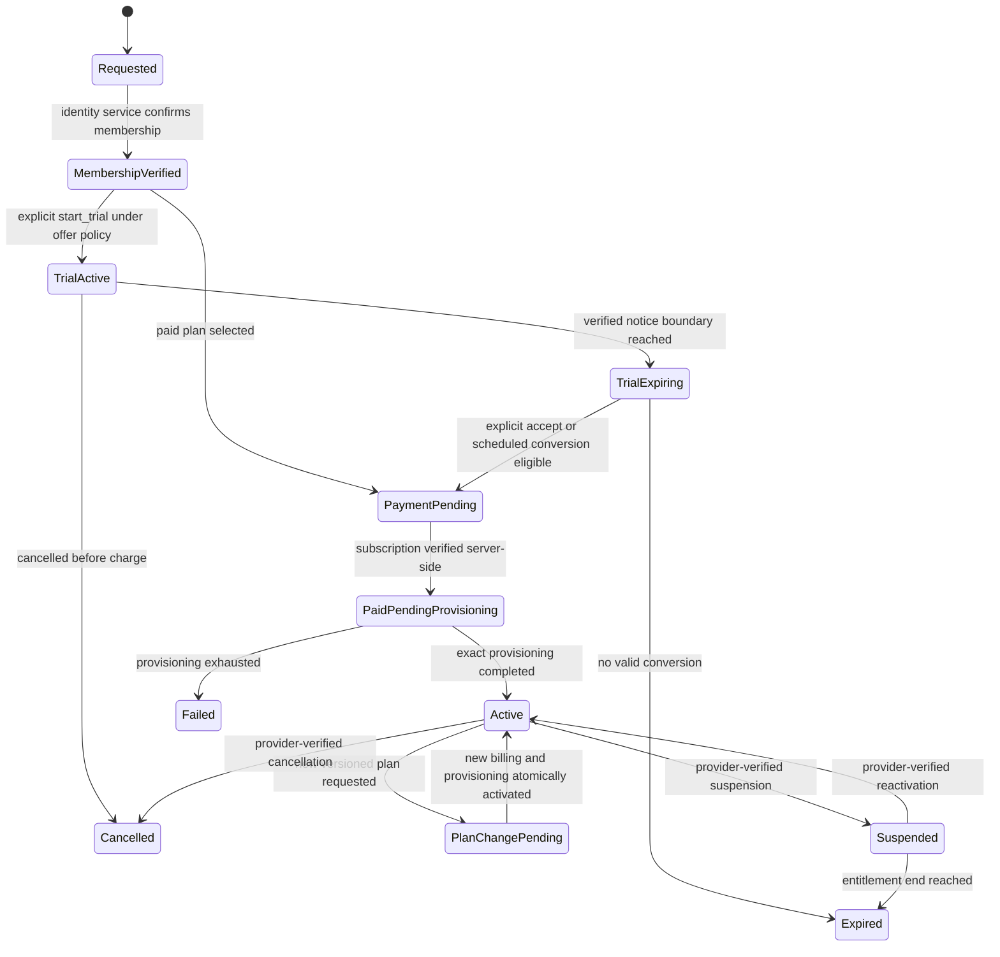
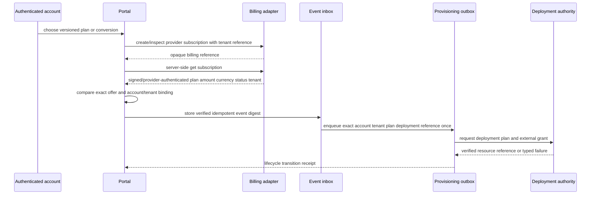
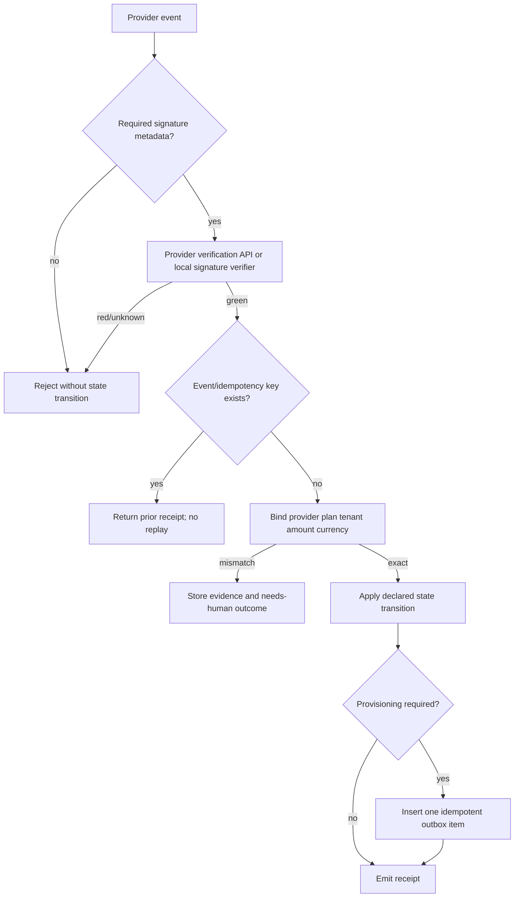
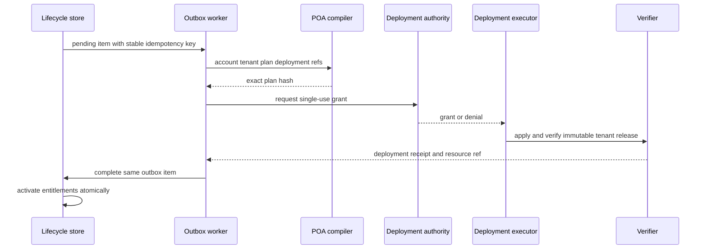

# SaaS Lifecycle logic flow

## Signup, trial and conversion

`PaymentPending` and `PaidPendingProvisioning` are intentionally separate. An
account is not active until both billing and tenant provisioning are verified.

## Subscription confirmation

A browser SDK success callback may initiate the `get subscription` step. It
cannot skip it or construct the verified event.

## Webhook/event processing

Event ordering is provider-specific, but a conforming adapter MUST make stale
or contradictory events explicit. It cannot let an older activation override a
newer cancellation without a verified provider state lookup.

## Provisioning and plan change

Retries reuse the same outbox item and deployment idempotency key. A failed
attempt increments its bounded attempt counter and records an evidence
reference, not a raw exception containing secrets.

## Failure routing

| Failure | Required state/outcome | Safe next action |
| --- | --- | --- |
| Missing trial conversion policy | `denied` | publish a new offer version |
| UI says paid without server verification | `billing_pending` | query provider server-side |
| Unsigned or invalid webhook | `denied` | reject and audit digest |
| Duplicate event | prior receipt | no state transition or new outbox item |
| Plan/amount/currency/tenant mismatch | `failed` or quarantine | reconcile with provider evidence |
| Billing verified, provisioning pending | `paid_pending_provisioning` | process durable outbox |
| Provisioning failed | `failed` | bounded retry or human remediation |
| Plan change partially completed | `plan_change_pending` | retain old active entitlements |
| Trial ends without eligible conversion | `expired` | require a new explicit selection |

No failure path stores payment credentials or turns a transport-level success
into an active tenant.
