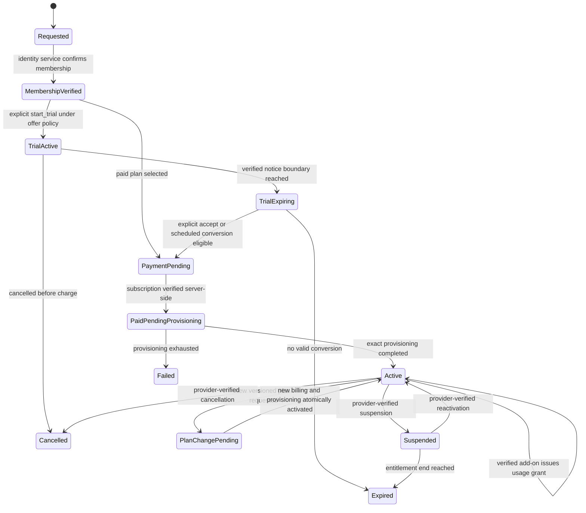
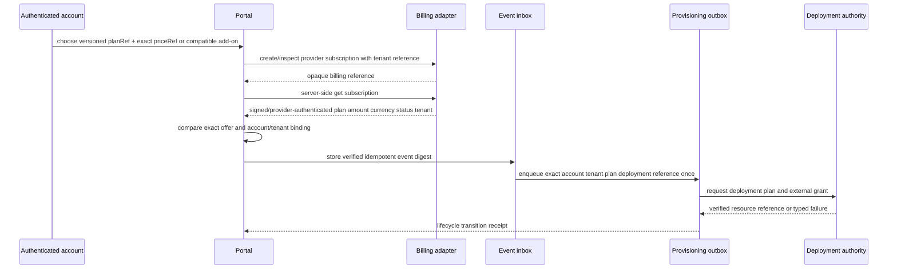
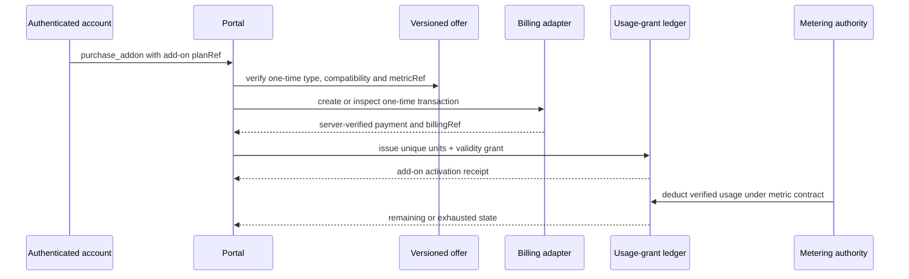
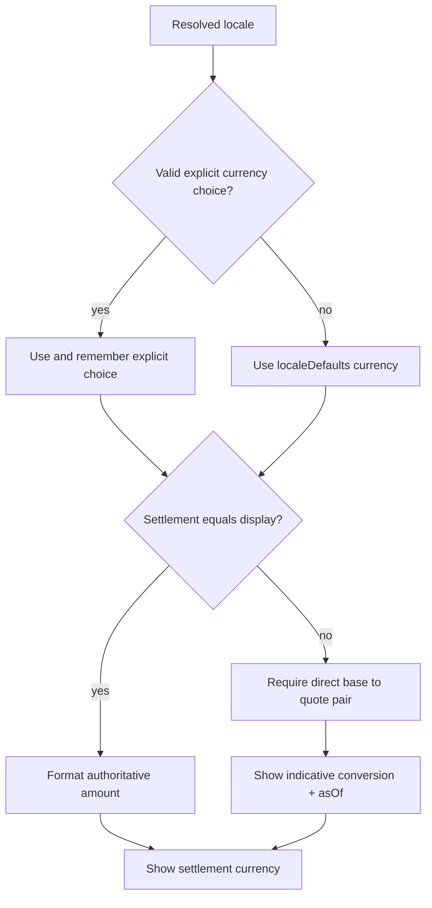
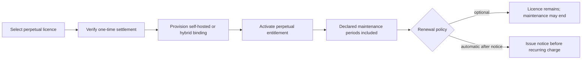
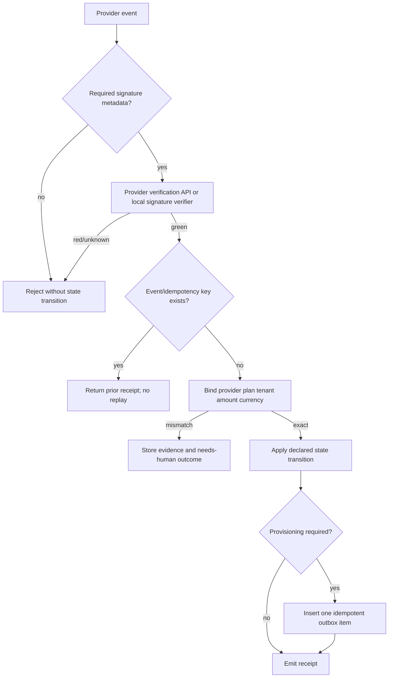
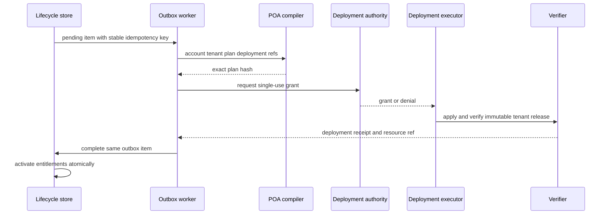

# SaaS Lifecycle logic flow

## Signup, trial and conversion

`PaymentPending` and `PaidPendingProvisioning` are intentionally separate. An
account is not active until both billing and tenant provisioning are verified.
`purchase_addon` is deliberately not a base-plan transition: after verified
one-time settlement it adds a usage grant while `currentPlanRef` remains the
same.

## Closed onboarding profiles

An adopter MUST declare exactly one onboarding profile for a public signup
surface. Profiles constrain when membership, payment method and trial may
advance; they do not invent new lifecycle states.

| Profile id | Order | Card / payment method | Typical product path |
| --- | --- | --- | --- |
| `membership-before-payment` | register → membership/OTP identity bind → plan select → checkout | Required at checkout (unless a separate promo profile allows bypass) | Subactor Cloud OTP sheet |
| `payment-at-trial` | register → membership → trial with declared payment-method policy → conversion | Per trial policy (`requiresPaymentMethod`) | Classic trial-first SaaS |
| `nocc-promo` | register → membership → Basic + eligible promo (e.g. `NOCC100`) → card bypass for that decision only | Deferred while promotion eligibility remains true | Promo overlay on either path above |

Normative rules:

1. **Membership before payment.** Under `membership-before-payment`, a portal
   MUST NOT treat PayPal/Stripe success, a client callback or a remembered
   cookie as membership. `REQUESTED → MEMBERSHIP_VERIFIED` remains owned by the
   identity authority (OTP, access API or equivalent). Checkout may start only
   after membership is verified for that account.
2. **Payment does not grant roles.** Verified billing may enqueue provisioning;
   it MUST NOT invent Founder/org roles or skip identity binding.
3. **NOCC is a promo overlay, not a third lifecycle graph.** `nocc-promo`
   changes card requirement for an eligible decision only. When eligibility is
   absent or sanitized, the underlying profile (`membership-before-payment` or
   `payment-at-trial`) remains in force.
4. **AuthN vs AuthZ.** Membership / OTP authentication profiles belong in a
   dedicated auth-lifecycle pack (or interim identity adapter). This standard
   binds the membership *signal*; `wellmanifest/authority-lifecycle` binds
   grants and leases; `wellmanifest/account-runtime` binds isolated tool
   runtimes. Cross-refs MUST stay ADOPT pins, not duplicated HOME rules.

Fail-closed outcomes for profile violations:

| Violation | Outcome / state | Code hint |
| --- | --- | --- |
| Checkout before membership | `denied` | `SAAS-ONBOARD-001` |
| Client-declared paid without membership | `billing_pending` then deny activation | `SAAS-ONBOARD-002` |
| NOCC applied to ineligible plan | promo sanitized; card required | sales policy + `SAAS-ONBOARD-003` |
| Unknown onboarding profile id | `denied` | `SAAS-ONBOARD-004` |

## Subscription confirmation

A browser SDK success callback may initiate the `get subscription` step. It
cannot skip it or construct the verified event.

## Usage package and PrePaid add-on

The recurring base allowance and each PrePaid purchase are separate grants or
ledger sources. A top-up has `reset: never`; it expires at its declared boundary
and cannot renew silently. Deduction order, aggregation and the semantic meaning
of one unit belong to the referenced metering contract. The SaaS lifecycle owns
only the commercial source, verified amount, remaining balance and validity.

Two tiers may share `capabilityParityGroup`. In that case they have exactly the
same entitlements and differ only in commercial values such as price and
included units. UI labels such as Basic or Pro never replace the stable plan
reference or introduce an undeclared seat restriction.

## Localized currency presentation

Every amount is converted from the selected `priceRef`'s own settlement
currency. This is important when one stable plan offers monthly and annual
prices, or Cloud packages settle in one currency and a self-hosted licence in
another. Indirect or undated conversion is rejected; a displayed amount is
never accepted as provider settlement evidence.

## Perpetual self-hosted licence

A perpetual licence is not a Cloud usage subscription. Optional maintenance is
a separate recurring settlement and its end cannot silently disable a granted
perpetual entitlement unless an external legal/licence contract explicitly
defines a different product.

## Webhook/event processing

Event ordering is provider-specific, but a conforming adapter MUST make stale
or contradictory events explicit. It cannot let an older activation override a
newer cancellation without a verified provider state lookup.

## Provisioning and plan change

Retries reuse the same outbox item and deployment idempotency key. A failed
attempt increments its bounded attempt counter and records an evidence
reference, not a raw exception containing secrets.

## Failure routing

| Failure | Required state/outcome | Safe next action |
| --- | --- | --- |
| Checkout before membership (`membership-before-payment`) | `denied` (`SAAS-ONBOARD-001`) | complete identity bind / OTP first |
| Client-declared paid without membership | `billing_pending` then deny (`SAAS-ONBOARD-002`) | verify membership, then provider |
| Unknown onboarding profile id | `denied` (`SAAS-ONBOARD-004`) | publish a closed profile id |
| Missing trial conversion policy | `denied` | publish a new offer version |
| UI says paid without server verification | `billing_pending` | query provider server-side |
| Unsigned or invalid webhook | `denied` | reject and audit digest |
| Duplicate event | prior receipt | no state transition or new outbox item |
| Plan/amount/currency/tenant mismatch | `failed` or quarantine | reconcile with provider evidence |
| Billing verified, provisioning pending | `paid_pending_provisioning` | process durable outbox |
| Provisioning failed | `failed` | bounded retry or human remediation |
| Plan change partially completed | `plan_change_pending` | retain old active entitlements |
| Add-on incompatible with current base plan or metric | `denied` | select a compatible versioned add-on |
| UI claims top-up credit before payment verification | `billing_pending` | verify transaction server-side |
| Usage grant exhausted or expired | unavailable allowance | stop, use another valid grant or purchase explicitly |
| Missing base/quote pair for locale currency | settlement amount only | do not fabricate an indicative conversion |
| Request omits or mismatches priceRef | `denied` | select one declared interval and exact versioned price |
| Maintenance not renewed | perpetual licence remains active | end maintenance services according to policy |
| Trial ends without eligible conversion | `expired` | require a new explicit selection |

No failure path stores payment credentials or turns a transport-level success
into an active tenant.
